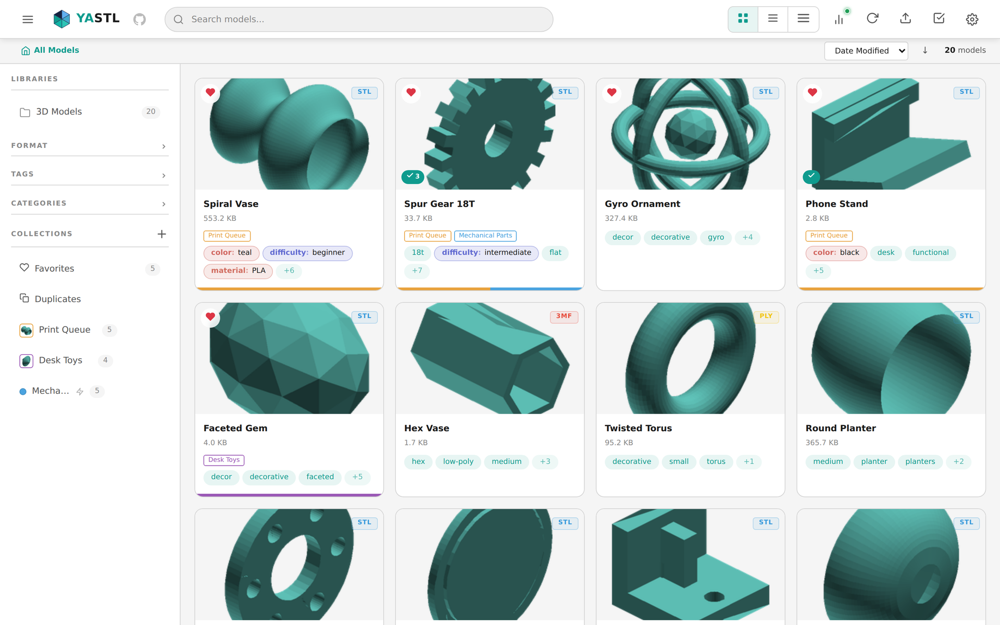
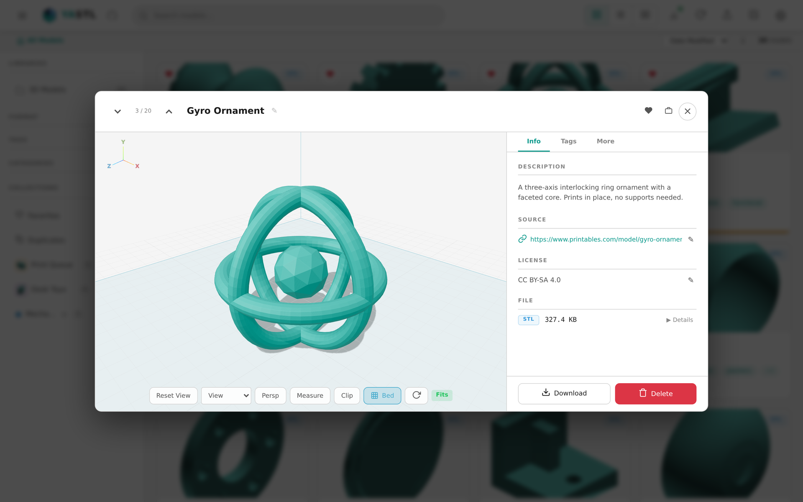
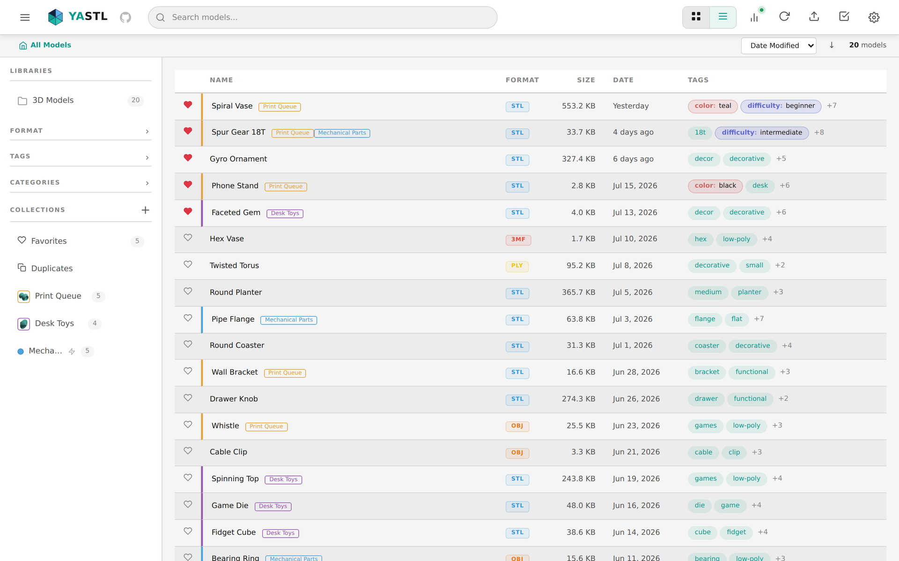
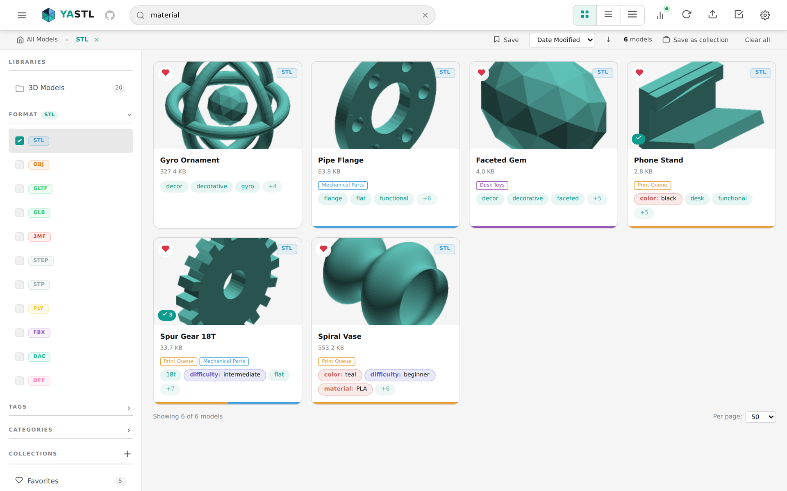
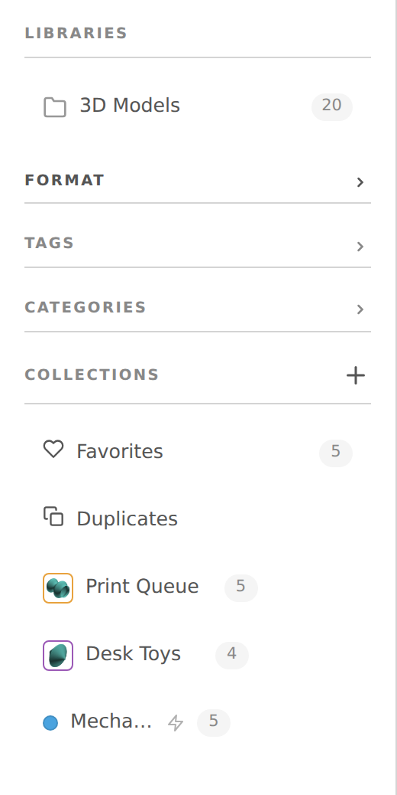
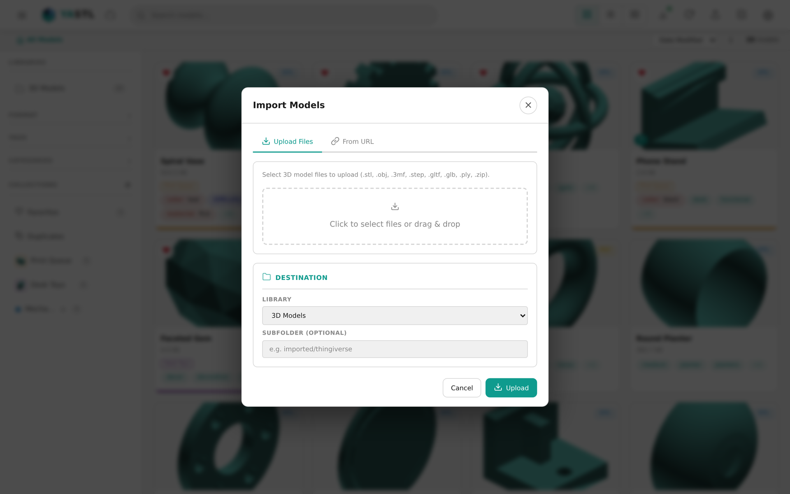
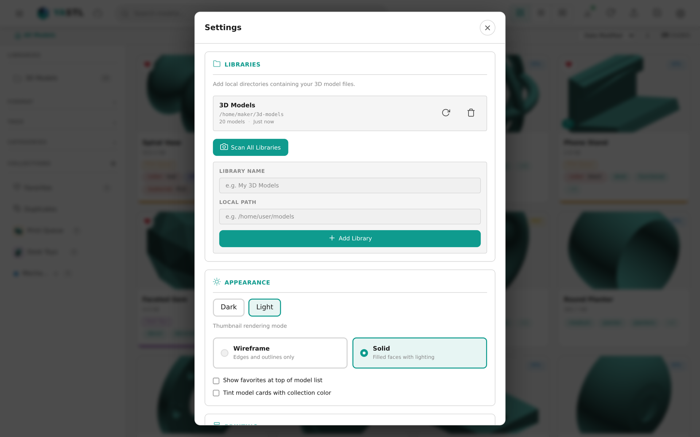
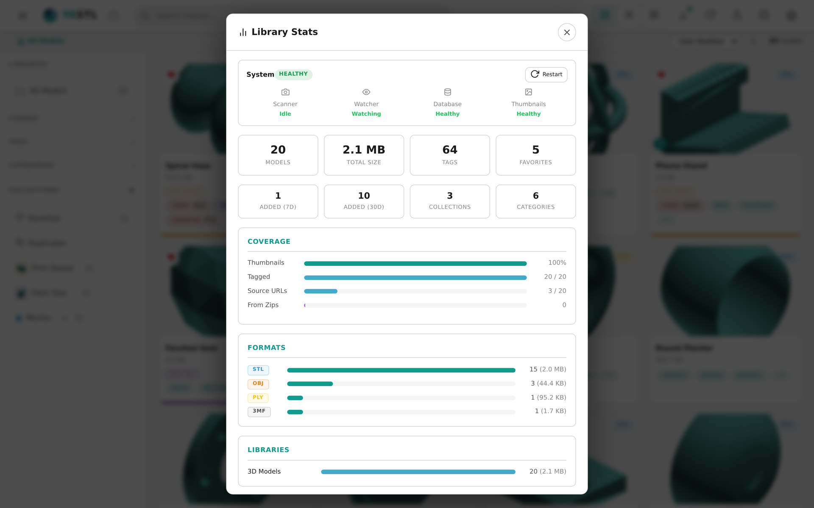
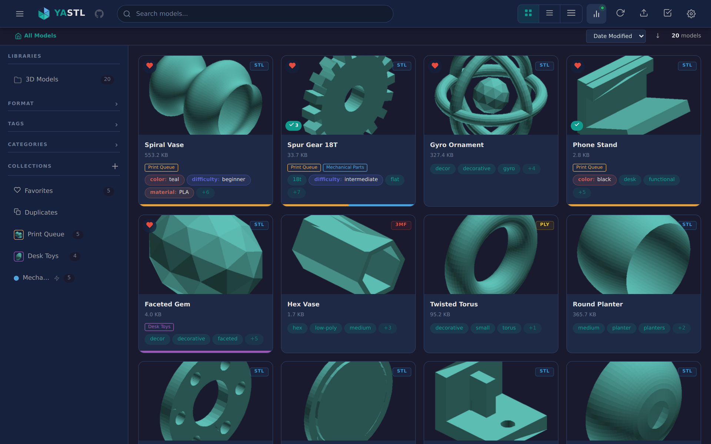
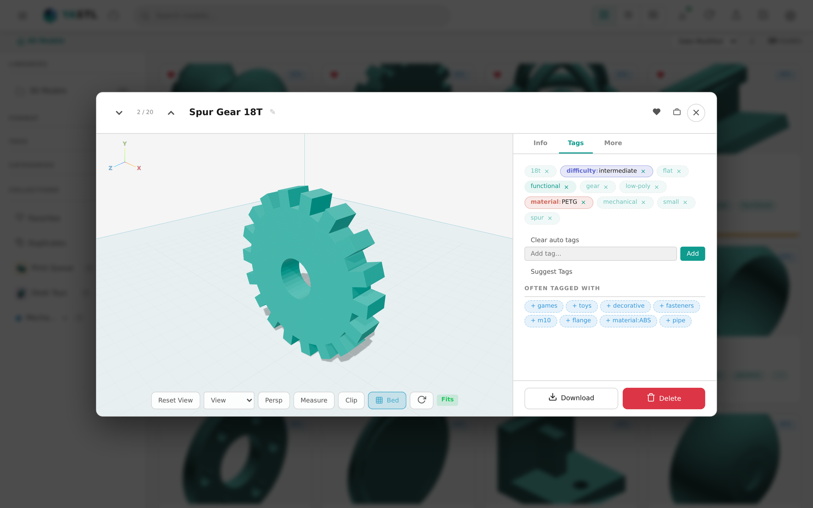

# YASTL - Yet Another STL

A personal 3D model library web application for browsing, searching, and previewing 3D model files. Built with Python/FastAPI backend and Vue 3 + Three.js frontend.



## Features

- **Wide format support** — STL, OBJ, glTF/GLB, 3MF, STEP, FBX, PLY, DAE, OFF
- **Interactive 3D viewer** — Three.js-powered in-browser preview with orbit controls and theme-aware lighting
- **Full-text search** — SQLite FTS5 across model names and descriptions with tag/category/format filters
- **Auto-import** — Directory scanner with file watcher for automatic library updates
- **Server-side thumbnails** — Auto-generated preview images (wireframe or solid mode)
- **Duplicate detection** — xxHash-based file deduplication with visual indicators
- **Tags & categories** — Flat tags and hierarchical categories auto-created from directory structure
- **Collections** — Manual and smart collections with color coding and filter rules
- **Zip archive support** — Browse models inside zip files with extraction caching
- **Print bed overlay** — Configurable bed dimensions with presets for common printers (Ender 3, Prusa, Bambu Lab, Voron)
- **URL import** — Download models from Thingiverse, Printables, MakerWorld, Cults3D, MyMiniFactory, Thangs
- **File upload** — Drag-and-drop file upload with metadata fields
- **Error tracking** — Failed/skipped files appear in a "Failed to Process" collection with error reasons
- **Dark/light themes** — Modern responsive UI with grid and list views
- **In-app updates** — Git-based update check and apply from the settings panel

## Screenshots

| | |
|---|---|
|  |  |
| Model grid with thumbnails and badges | Interactive 3D viewer with detail panel |
|  |  |
| Sortable list view | Search with filter breadcrumbs |
|  |  |
| Collections sidebar with smart filters | URL import and file upload |
|  |  |
| Library settings and print bed config | Library statistics and system health |
|  |  |
| Dark theme support | Model metadata and tabs |

## Tech Stack

| Layer | Technology |
|-------|-----------|
| Backend | Python 3.11+ / FastAPI / Uvicorn |
| Database | SQLite 3 with WAL mode + FTS5 |
| 3D Processing | trimesh, numpy-stl, pygltflib, manifold3d |
| Frontend | Vue 3 (Vite SFC) + Three.js |
| Hashing | xxhash (xxh128) |
| File Watching | watchdog |

## Quick Start

### Docker Compose

```bash
# Edit docker-compose.yml to set your model directory path
docker compose up -d
```

The app will be available at `http://localhost:8000`.

### Local Development

```bash
python -m venv .venv
source .venv/bin/activate
pip install -e ".[dev]"

# Build frontend
cd frontend && npm install && npm run build && cd ..

# Run dev server
uvicorn app.main:app --reload --host 0.0.0.0 --port 8000
```

### Environment Variables

| Variable | Default | Description |
|----------|---------|-------------|
| `YASTL_MODEL_LIBRARY_DB` | `/data/library.db` | SQLite database path |
| `YASTL_MODEL_LIBRARY_SCAN_PATH` | *(none)* | Legacy: auto-imports as a library on first start |
| `YASTL_MODEL_LIBRARY_THUMBNAIL_PATH` | `/data/thumbnails` | Thumbnail storage directory |

Libraries are managed via the web UI Settings page.

## Proxmox LXC Install

Run this one-liner on your Proxmox host to create an LXC container with YASTL fully installed:

```bash
bash -c "$(curl -fsSL https://raw.githubusercontent.com/Pr0zak/YASTL/main/ct-install.sh)"
```

The interactive installer will prompt for your NFS server, container resources, and network settings. It handles everything: downloading the Debian template (if needed), creating the container, installing dependencies, and starting the service.

### Non-interactive install

Set environment variables to skip the prompts:

```bash
export NFS_SERVER=192.168.1.100
export NFS_SHARE=/volume1/3dPrinting
export CT_ID=200
export YASTL_NONINTERACTIVE=1
bash -c "$(curl -fsSL https://raw.githubusercontent.com/Pr0zak/YASTL/main/ct-install.sh)"
```

### From a cloned repo

If you've already cloned the repo, you can use the setup script directly:

```bash
export NFS_SERVER=192.168.1.100
export NFS_SHARE=/volume1/3dPrinting
./deploy/proxmox-setup.sh
```

### Container management

Once installed, manage YASTL from the Proxmox host:

```bash
pct exec 200 -- systemctl status yastl    # Check status
pct exec 200 -- journalctl -u yastl -f    # View logs
pct exec 200 -- systemctl restart yastl   # Restart
pct exec 200 -- yastl-update              # Pull latest and restart
```

See `ct-install.sh` and `deploy/proxmox-setup.sh` for all configuration options.

## API Endpoints

| Method | Endpoint | Description |
|--------|----------|-------------|
| GET | `/api/models` | List models (paginated, filterable) |
| GET | `/api/models/{id}` | Get model details |
| PUT | `/api/models/{id}` | Update model name/description/source_url |
| DELETE | `/api/models/{id}` | Remove model from library |
| GET | `/api/models/{id}/file` | Download/serve 3D file |
| GET | `/api/models/{id}/thumbnail` | Serve thumbnail image |
| POST | `/api/models/{id}/tags` | Add tags to model |
| GET | `/api/models/duplicates` | Find duplicate files |
| GET | `/api/search?q=query` | Full-text search |
| GET | `/api/tags` | List all tags |
| GET | `/api/categories` | List category tree |
| GET | `/api/collections` | List collections |
| POST | `/api/scan` | Trigger library scan |
| GET | `/api/scan/status` | Check scan progress |
| GET | `/api/stats` | Library statistics |
| GET | `/api/status` | System health status |
| POST | `/api/import` | Import models from URL |
| POST | `/api/import/upload` | Upload model files |
| GET | `/api/settings` | Get app settings |
| PUT | `/api/settings` | Update settings |
